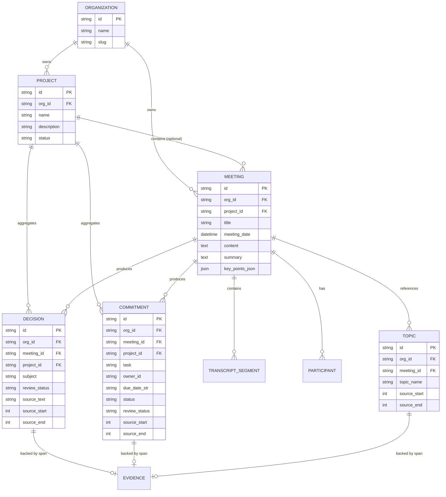
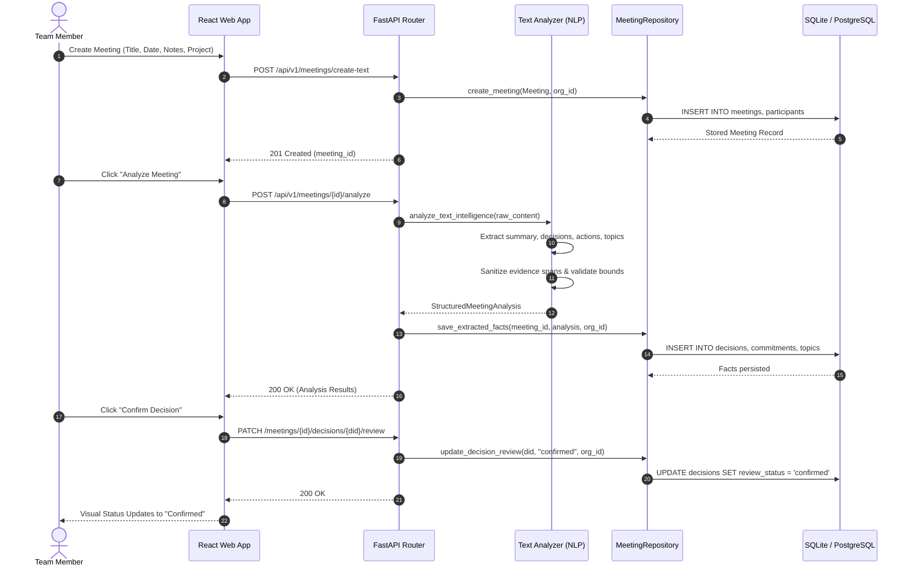

# MeetingOS

> **Text-First AI Meeting Intelligence & Organizational Memory System**

[](https://www.python.org/)
[](https://fastapi.tiangolo.com/)
[](https://react.dev/)
[](https://www.typescriptlang.org/)
[](https://www.postgresql.org/)
[](tests/)
[](apps/web/)
[](apps/web/)
[](#20-multi-tenant-security)

---

## Table of Contents

1. [Overview](#1-overview)
2. [Problem Statement](#2-problem-statement)
3. [Solution Architecture](#3-solution-architecture)
4. [Key Features](#4-key-features)
5. [System Architecture](#5-system-architecture)
6. [Technology Stack](#6-technology-stack)
7. [Frontend Architecture](#7-frontend-architecture)
8. [Backend Architecture](#8-backend-architecture)
9. [Database Architecture](#9-database-architecture)
10. [Entity Relationship Diagram](#10-entity-relationship-diagram)
11. [AI / NLP Pipeline](#11-ai--nlp-pipeline)
12. [AI Safety and Zero-Hallucination Guardrails](#12-ai-safety-and-zero-hallucination-guardrails)
13. [Source Evidence and Traceability](#13-source-evidence-and-traceability)
14. [Meeting Workspace](#14-meeting-workspace)
15. [Project Workspace & Timelines](#15-project-workspace--timelines)
16. [Organizational Knowledge & Topic Evolution](#16-organizational-knowledge--topic-evolution)
17. [Global Search & Command Palette](#17-global-search--command-palette)
18. [API Reference](#18-api-reference)
19. [End-to-End Data Flow](#19-end-to-end-data-flow)
20. [Multi-Tenant Security](#20-multi-tenant-security)
21. [Repository Structure](#21-repository-structure)
22. [Product Launch Demo Scenario](#22-product-launch-demo-scenario)
23. [Installation & Setup](#23-installation--setup)
24. [Environment Variables](#24-environment-variables)
25. [Running the Application](#25-running-the-application)
26. [Quick Demo Guide](#26-quick-demo-guide)
27. [Testing Strategy](#27-testing-strategy)
28. [Reliability & Edge Cases](#28-reliability--edge-cases)
29. [Security Considerations](#29-security-considerations)
30. [Current Limitations](#30-current-limitations)
31. [Future Scope](#31-future-scope)
32. [Design Principles](#32-design-principles)
33. [Academic Project Value](#33-academic-project-value)
34. [Key Technical Questions (Viva Preparation)](#34-key-technical-questions-viva-preparation)
35. [Conclusion](#35-conclusion)

---

## 1. Overview

**MeetingOS** is an open-source, text-first AI meeting intelligence and organizational knowledge management system. 

Unlike conventional meeting tools that generate simple summaries or treat meetings as isolated silos, MeetingOS models an **Organizational Memory System**. It converts raw meeting text (transcripts, pasted conversation logs, structured discussion notes) into structured, verifiable deliverables:

* **Executive Summaries & Key Takeaways**
* **Organizational Decisions** (with explicit review states: `Needs Review`, `Confirmed`, `Edited`, `Rejected`)
* **Action Items & Commitments** (with verified owners, due dates, priority levels, and overdue status)
* **Topic Knowledge Evolution** (tracking discussions and decisions across time and projects)
* **Verifiable Source Evidence Spans** (direct bidirectional linking and visual highlighting of source text)
* **Project Workspaces & Timelines** (aggregating deliverables across project lifecycles)
* **Real-time Meeting Presence & Review Synchronization** (live WebSocket-based multi-user workspace presence)
* **Strict Multi-Tenant Organization Isolation** (authoritative server-side scoping preventing cross-org leakage)

> *Note on Legacy Audio Modules:* Early experimental iterations included speech-to-text audio ingestion pipelines. In the current production release, meeting creation is completely **text-first** (transcripts and notes). Legacy audio modules remain isolated in the repository as reference code and are deprecated from the primary user journey.

---

## 2. Problem Statement

In modern collaborative workplaces and engineering organizations, meeting information suffers from critical failure modes:

1. **Ephemeral Context**: Important organizational decisions and technical choices made during meetings are lost once the call ends.
2. **Untracked Action Items**: Action items and commitments are buried inside paragraphs of transcript text without clear ownership, deadlines, or priority.
3. **Hallucination and Misattribution**: Generic AI summary tools frequently invent ownership, hallucinate dates, and misrepresent tentative suggestions as binding decisions.
4. **Lack of Traceability**: Users cannot verify *why* an AI generated a summary or *where* in the transcript a commitment was made.
5. **Isolated Meeting Silos**: Meetings exist in isolation; teams lack a structured historical view of how topics and decisions evolve across sprints and projects.
6. **Information Retrieval Friction**: Finding a past decision requires manually searching across meeting notes, chat threads, and emails.

MeetingOS solves these challenges by providing a structured, verifiable extraction pipeline coupled with human-in-the-loop review, strict evidence bounds safety, and cross-meeting knowledge synthesis.

---

## 3. Solution Architecture

The core organizational memory loop converts unstructured meeting text into interconnected organizational memory:

```
Meeting Transcript / Notes
          │
          ▼
   Text Parser & Normalizer
          │
          ▼
 Structured Information Extraction
          │
          ▼
 Zero-Hallucination Guardrails & Bounds Safety
  (No fabricated owners, no invented dates, clamped spans)
          │
  ┌───────┼────────────────┬───────────────┐
  ▼       ▼                ▼               ▼
Summary Decisions     Action Items      Topics
  │       │                │               │
  │       ▼                ▼               │
  │   Human Review     Human Review        │
  │  [Confirm/Edit]   [Confirm/Edit]       │
  │       │                │               │
  └───────┴───────┬────────┴───────────────┘
                  ▼
         Source Evidence Links
        (Text Span Highlighting)
                  │
  ┌───────────────┴────────────────┐
  ▼                                ▼
Project Workspace          Knowledge Graph
 (Aggregated Timelines)  (Topic Evolution)
  │                                │
  └───────────────┬────────────────┘
                  ▼
      Unified Search & Command Palette (Ctrl+K)
                  │
                  ▼
        Organizational Memory
```

---

## 4. Key Features

| Category | Implemented Feature | Description |
| :--- | :--- | :--- |
| **Meeting Intelligence** | **Text-First Meeting Creation** | Create meetings by title, date, participants, project, and transcript/notes input. |
| | **Structured AI Extraction** | Generates executive summaries, bulleted key takeaways, decisions, action items, and topic tags. |
| | **Deterministic Fallback** | Robust rule-based heuristic extractor guarantees analysis even without external cloud LLM API keys. |
| | **Source Evidence Spans** | Every decision, action, and topic links to exact start/end character offsets with visual highlighting in the source transcript. |
| | **Human-in-the-Loop Review** | Supports `Needs Review`, `Confirmed`, `Edited`, and `Rejected` states on decisions and action items. |
| **Deliverables & Actions** | **Action Items Registry** | Global cross-meeting deliverable tracker with status filters (`Open`, `In Progress`, `Completed`, `Overdue`, `Unassigned`). |
| | **Overdue Date Calculations** | Dynamic overdue badges computed from actual ISO date values without misclassifying ambiguous strings. |
| | **Conservative Ownership** | Zero-hallucination owner attribution; unstated owners default strictly to `Unassigned`. |
| **Decisions Registry** | **Organizational Decisions** | Cross-meeting decision catalog with impact descriptions, review status indicators, and source meeting links. |
| **Projects & Timelines** | **Project Workspaces** | Dedicated project views aggregating meeting count, active deliverables, decisions, and participants. |
| | **Chronological Timeline** | Unified chronological timeline visualizing meetings, decisions, and action milestones. |
| | **Safe Project Unlinking** | Project deletion cleanly unlinks associated meetings without cascading data destruction. |
| **Organizational Knowledge** | **Topic Evolution** | Multi-meeting topic aggregation tracking where topics appear, connected decisions, and resulting actions over time. |
| | **Deterministic Normalization** | Automatically normalizes topic casing and preserves technical acronyms (`API`, `UI/UX`, `AI`, `ML`, `SQL`). |
| **Search & Discovery** | **Global Command Palette (`Ctrl+K`)** | Instant modal search with quick navigation chips, topic suggestions, and keyboard navigation (`↑`/`↓`/`↵`/`Esc`). |
| | **Search & QA Workspace** | Full-text keyword search and multi-agent question answering with verifiable citations. |
| **Collaboration** | **Live Workspace Presence** | WebSocket-based real-time presence indicators displaying active viewers in the meeting workspace. |
| | **Live Review Sync** | Real-time broadcast of decision/action confirmations and edits across connected browser sessions. |
| **Integrations** | **Calendar Provider Abstraction** | Normalized `BaseCalendarProvider`, `GoogleCalendarProvider`, and `MicrosoftCalendarProvider` registry with zero-hallucination event import. |
| **Security & Multi-Tenancy** | **Tenant Boundary Isolation** | Authenticated `UserIdentity` scopes all queries by `org_id`. Tested zero cross-tenant leakage. |
| | **3-Tier RBAC** | Role-based access control with `owner`, `admin`, `member`, and `viewer` roles. |
| **Demo Experience** | **Product Launch Seed** | 1-click seeding of a 5-meeting scenario (*Kickoff*, *Architecture*, *Design*, *Readiness*, *Retrospective*). |

---

## 5. System Architecture

```
                    ┌────────────────────────────────────────┐
                    │          MeetingOS Web Client          │
                    │        React 18 + TypeScript + Vite    │
                    │  (Dashboard, Workspace, Knowledge, UI) │
                    └───────────────────┬────────────────────┘
                                        │
                         HTTP REST      │    WebSocket (/ws/meetings/{id})
                         (/api/v1)      │    (Presence & Review Sync)
                                        ▼
                    ┌────────────────────────────────────────┐
                    │             FastAPI Backend            │
                    │      (Authentication & RBAC Middleware)│
                    └───────────────────┬────────────────────┘
                                        │
           ┌────────────────────────────┼────────────────────────────┐
           ▼                            ▼                            ▼
┌──────────────────────┐     ┌──────────────────────┐     ┌──────────────────────┐
│  Router & API Layer  │     │   AI & NLP Engine    │     │  Collaboration Hub   │
│  - /meetings         │     │  - text_analyzer.py  │     │  - PresenceManager   │
│  - /projects         │     │  - heuristic parser  │     │  - review_sync       │
│  - /action-items     │     │  - zero-hallucination│     │  - active viewers    │
│  - /decisions        │     │  - span sanitizer    │     │  - WebSocket rooms   │
│  - /knowledge        │     │  - topic normalizer  │     └──────────────────────┘
│  - /search           │     │  - Cloud LLM adapter │
│  - /calendar         │     └──────────┬───────────┘
└──────────┬───────────┘                │
           │                            │
           ▼                            ▼
┌───────────────────────────────────────────────────┐
│              MeetingRepository Layer              │
│       - Tenant-Scoped SQL Queries (org_id)        │
│       - Atomic Transactions & Safe Unlinking      │
│       - Relational & Temporal Aggregations        │
└─────────────────────────┬─────────────────────────┘
                          │
                          ▼
┌───────────────────────────────────────────────────┐
│            Database Persistence Layer             │
│      - SQLite + aiosqlite (Local Dev / Tests)     │
│      - PostgreSQL 16 (Production Relational DB)   │
│      - Auto-Reconciled Schema Migrations (init_db)│
└───────────────────────────────────────────────────┘
```

---

## 6. Technology Stack

| Layer | Technology | Version | Purpose |
| :--- | :--- | :--- | :--- |
| **Frontend Framework** | **React** | 18.3.1 | Component-driven user interface |
| **Frontend Language** | **TypeScript** | 5.5.3 | Static type safety and data models |
| **Frontend Build Tool** | **Vite** | 8.2.2 | Fast HMR and production bundle optimization |
| **Client Routing** | **React Router (HashRouter)** | 6.26.2 | Single-page application navigation |
| **UI Icons** | **Lucide React** | 0.441.0 | Consistent iconography |
| **Backend Framework** | **FastAPI** | >=0.115.0 | High-performance asynchronous REST API |
| **Backend Language** | **Python** | 3.12 | Core backend, data models, and NLP pipelines |
| **Data Validation** | **Pydantic v2** | >=2.8.0 | Strict schema validation and CMF contracts |
| **ORM / Database Access** | **SQLAlchemy** | 2.0 (Async) | Asynchronous object-relational mapping |
| **Database Drivers** | **aiosqlite / asyncpg** | latest | Async database drivers for SQLite & PostgreSQL |
| **Primary Databases** | **SQLite / PostgreSQL** | 3.x / 16 | Relational persistence and tenant isolation |
| **Backend Testing** | **pytest / pytest-asyncio** | >=8.3.0 | 193-test automated backend test suite |
| **Frontend Testing** | **Vitest / Testing Library** | 2.1.9 | Frontend unit and component test suite |
| **Code Formatting/Lint** | **Ruff / TypeScript Compiler**| latest | Static analysis and format verification |

---

## 7. Frontend Architecture

The frontend is located in `apps/web/` and built as a modern, responsive React + TypeScript Single Page Application (SPA).

```
apps/web/
├── src/
│   ├── App.tsx                     # Top-level application shell and route declarations
│   ├── App.test.tsx                # Frontend integration and component tests (Vitest)
│   ├── main.tsx                    # React DOM root entrypoint
│   ├── index.css                   # Design tokens, typography, and responsive styles
│   ├── components/
│   │   ├── Header.tsx              # Global header with search trigger and org badge
│   │   ├── Sidebar.tsx             # Primary navigation menu (Workspace, Intelligence, System)
│   │   └── GlobalSearchModal.tsx   # Ctrl+K Command Palette with quick navigation
│   ├── pages/
│   │   ├── Dashboard.tsx           # Workspace overview, recent meetings, deliverable KPIs
│   │   ├── CreateMeeting.tsx       # 3-step text-first meeting creation wizard + Calendar import
│   │   ├── MeetingsList.tsx        # Filterable meeting directory with source badges
│   │   ├── MeetingDetail.tsx       # Meeting Workspace: Summary, Decisions, Actions, Evidence, WebSocket
│   │   ├── ProjectsList.tsx        # Projects catalog and creation modal
│   │   ├── ProjectDetail.tsx       # Project Workspace: Overview, Timeline, Decisions, Actions
│   │   ├── ActionItems.tsx         # Deliverables table with Overdue/Unassigned tabs and review
│   │   ├── DecisionsPage.tsx       # Decisions registry with status filters and review controls
│   │   ├── KnowledgePage.tsx       # Topic knowledge explorer with cross-meeting timeline
│   │   ├── SearchQA.tsx            # Full-text search and grounded Q&A
│   │   ├── TeamPage.tsx            # Organization participant roster and activity metrics
│   │   ├── Settings.tsx            # Workspace configuration and demo data seeder
│   │   ├── TraceExplorer.tsx       # Multi-agent execution trace viewer
│   │   └── MetricsDashboard.tsx    # System telemetry and operational metrics
│   └── services/
│       └── api.ts                  # Typed Axios/Fetch API client with tenant headers
├── package.json
├── tsconfig.json
└── vite.config.ts
```

---

## 8. Backend Architecture

The backend is located in `apps/api/` with shared packages in `packages/`:

```
apps/api/
├── main.py                         # FastAPI lifespan context, CORS, and router registrations
├── auth.py                         # RBAC Bearer token validator and UserIdentity dependency
├── config.py                       # Pydantic BaseSettings environment configuration
├── routers/
│   ├── meetings.py                 # Text-first meeting creation, extraction, review, export
│   ├── projects.py                 # Project CRUD, timelines, decisions, and action linking
│   ├── actions.py                  # Global cross-meeting deliverable registry
│   ├── decisions.py                # Cross-meeting organizational decision registry
│   ├── knowledge.py                # Topic aggregation and cross-meeting evolution detail
│   ├── search.py                   # Unified global search across entities and transcripts
│   ├── query.py                    # Multi-agent grounded Q&A with evidence citations
│   ├── calendar.py                 # External calendar provider listing and event import
│   ├── collaboration.py            # WebSocket presence manager and review broadcast
│   ├── demo.py                     # Product Launch demo data seeder and reset
│   ├── dashboard.py                # Workspace KPI aggregation
│   ├── team.py                     # Participant and team analytics
│   ├── organizations.py            # Organization workspace management
│   ├── audit.py                    # Compliance and access audit trail
│   ├── traces.py                   # Execution trace inspection
│   ├── metrics.py                  # System latency and token telemetry
│   └── health.py                   # Liveness and readiness health checks
packages/
├── common/                         # Common Meeting Format (CMF) schemas and enums
├── nlp/                            # Text parsing, heuristic extraction, span bounds sanitizer
├── memory/                         # SQLAlchemy async models, repository pattern, init_db
├── connectors/                     # Calendar provider abstraction (Google, Microsoft)
├── agents/                         # Multi-agent reasoning pipeline (Planner, Evidence, Answer)
├── retrieval/                      # Hybrid reciprocal rank fusion (RRF) search
└── reasoning/                      # Temporal reconciliation and lifecycle reasoning
```

---

## 9. Database Architecture

MeetingOS uses SQLAlchemy 2.0 async ORM models defined in `packages/memory/models.py`.

| Entity / Table | Model Class | Primary Key | Key Attributes | Tenant Scoped (`org_id`) | Purpose |
| :--- | :--- | :--- | :--- | :---: | :--- |
| `organizations` | `OrganizationModel` | `id` (VARCHAR) | `name`, `slug`, `plan`, `settings_json` | Root | Top-level tenant boundary |
| `projects` | `ProjectModel` | `id` (VARCHAR) | `name`, `description`, `color`, `status` | Yes | Groups related meetings & deliverables |
| `meetings` | `MeetingModel` | `id` (VARCHAR) | `title`, `meeting_date`, `content`, `summary`, `key_points_json`, `project_id`, `processing_status` | Yes | Canonical meeting container and transcript |
| `transcript_segments` | `TranscriptSegmentModel` | `id` (VARCHAR) | `meeting_id`, `sequence`, `speaker_id`, `start_time`, `end_time`, `text` | Inferred | Timestamped, speaker-attributed utterances |
| `decisions` | `DecisionModel` | `id` (VARCHAR) | `meeting_id`, `project_id`, `subject`, `status`, `review_status`, `source_text`, `source_start`, `source_end` | Yes | Extracted organizational decisions & review state |
| `commitments` | `CommitmentModel` | `id` (VARCHAR) | `meeting_id`, `project_id`, `task`, `owner_id`, `due_date_str`, `status`, `review_status`, `priority`, `source_start`, `source_end` | Yes | Action items with owners, deadlines, priority |
| `topics` | `TopicModel` | `id` (VARCHAR) | `meeting_id`, `topic_name`, `category`, `source_start`, `source_end` | Yes | Extracted topic tags with normalized names |
| `participants` | `ParticipantModel` | `id` (VARCHAR) | `meeting_id`, `canonical_name`, `aliases` | Inferred | Human meeting participants |
| `speakers` | `SpeakerModel` | `id` (VARCHAR) | `meeting_id`, `speaker_id`, `name`, `canonical_entity_id` | Inferred | Diarization label mapping |
| `entities` | `EntityModel` | `id` (VARCHAR) | `name`, `entity_type`, `description` | Yes | Named entities (people, tech, projects) |
| `relationships` | `RelationshipModel` | `id` (VARCHAR) | `source_entity_id`, `target_entity_id`, `relation_type` | Yes | Knowledge graph edges |
| `events` | `EventModel` | `id` (VARCHAR) | `entity_id`, `event_type`, `description`, `timestamp` | Yes | Chronological lifecycle transition events |
| `audit_logs` | `AuditLogModel` | `id` (VARCHAR) | `actor_id`, `action`, `resource_type`, `resource_id`, `outcome` | Yes | Security audit trail |

---

## 10. Entity Relationship Diagram



---

## 11. AI / NLP Pipeline

The analysis pipeline in `packages/nlp/text_analyzer.py` transforms raw meeting notes or transcripts into structured intelligence:

```
Raw Meeting Text (Transcript or Notes)
                 │
                 ▼
     1. Text Segment Parsing
        - Regular expressions detect speaker prefixes ("Sarah:", "[David]:", "Alex - ")
        - Calculates line offsets and timestamps
                 │
                 ▼
     2. Intelligence Extraction (AI Provider / Deterministic Fallback)
        - Executive Summary (1-3 structured paragraphs)
        - Key Takeaways (list of bullet points)
        - Decision Candidate Extraction
        - Action Item & Commitment Extraction
        - Topic & Keyword Extraction
                 │
                 ▼
     3. Zero-Hallucination Normalization & Validation
        - Owner Verification: If no explicit person is named, owner = "Unassigned"
        - Deadline Verification: If no explicit date is mentioned, due_date = "Not specified"
        - Topic Normalization: normalize_topic_name() standardizes acronyms and title casing
                 │
                 ▼
     4. Source Evidence Bounds Sanitization
        - Clamps offsets: 0 <= start <= end <= len(raw_content)
        - Substring Verification: Matches span text against raw content
        - Offset Repair: Locates text via find() if offsets are misaligned
                 │
                 ▼
     5. StructuredMeetingAnalysis Object
        - Persisted atomically to PostgreSQL / SQLite database
```

---

## 12. AI Safety and Zero-Hallucination Guardrails

To prevent AI hallucinations in critical decision-making contexts, MeetingOS implements four architectural guardrails:

1. **Conservative Owner Attribution**: The system never guesses owners from speaking frequency or meeting creator identity. If a transcript says *"Someone should update the documentation"*, the owner is strictly set to `Unassigned`.
2. **Conservative Deadline Resolution**: Ambiguous relative terms like *"soon"*, *"later"*, or *"ASAP"* are never converted into invented calendar dates. They remain `"Not specified"` unless an explicit target date or day is stated.
3. **Explicit Uncertainty & Proposal Separation**: Tentative proposals containing *"should"*, *"maybe"*, or *"could"* default to review status `needs_review` and are not classified as binding until human confirmation.
4. **Human-in-the-Loop Review**: Extracted decisions and commitments carry a review status:
   * **Needs Review** (Initial AI extraction state)
   * **Confirmed** (Verified by team member)
   * **Edited** (Modified by team member)
   * **Rejected** (Dismissed as inaccurate extraction)

---

## 13. Source Evidence and Traceability

Every extracted decision, action item, and topic in MeetingOS is directly linked to its source evidence span within the original meeting text.

* **Offset Model**: Items store `source_text`, `source_start` (0-indexed character offset), and `source_end`.
* **Bounds Invariant**: Enforced by `sanitize_source_span()`:
  $$\text{Invariant: } 0 \le \text{source\_start} \le \text{source\_end} \le \text{len}(\text{raw\_content})$$
* **Interactive UI Highlighting**: Clicking the *"View source"* button in the Meeting Workspace automatically scrolls to the transcript pane and highlights the exact sentence in yellow.
* **Content Edit Protection**: If the raw meeting transcript is edited, `sanitize_source_span()` performs a case-insensitive fallback search to recalculate offsets or safely strips invalid spans.

---

## 14. Meeting Workspace

The **Meeting Workspace** (`/meetings/:id`) provides a unified, two-pane operational interface:

```
┌───────────────────────────────────────────────┬───────────────────────────────────────────────┐
│              MEETING INTELLIGENCE             │               ORIGINAL SOURCE                 │
├───────────────────────────────────────────────┼───────────────────────────────────────────────┤
│ Executive Summary                             │ Transcript / Notes Pane                       │
│ - Comprehensive 2-3 paragraph overview        │                                               │
│                                               │ [00:00] Alex: Welcome everyone. Let's review  │
│ Key Points                                    │ our Q4 launch strategy.                       │
│ • Staging release scheduled for Friday        │                                               │
│ • Onboarding flow signed off by design        │ [01:15] Sarah: Design onboarding flow is done.│
│                                               │ [02:30] David: [HIGHLIGHTED EVIDENCE SPAN]   │
│ Organizational Decisions                      │ Decision: We will enforce API rate limiting   │
│ [Decision Item] "Adopt API Rate Limiting"     │ of 100 requests per minute on public endpoints│
│ Evidence: "Decision: We will enforce API..."  │                                               │
│ Status: [Confirmed] [Edit] [Reject]           │ [03:45] Maya: Marketing announcements ready.  │
│                                               │                                               │
│ Action Items                                  │                                               │
│ [x] Task: Verify PostgreSQL connection pooling│                                               │
│ Owner: Alice Smith | Due: Wednesday | Priority: High                                         │
│ Status: [In Progress ▾] | Review: [Confirmed] │                                               │
└───────────────────────────────────────────────┴───────────────────────────────────────────────┘
```

---

## 15. Project Workspace & Timelines

The **Project Workspace** (`/projects/:id`) connects individual meetings into a coherent project narrative:

* **Aggregated Deliverables**: Displays total meeting count, open action items, total decisions, and active participants.
* **Chronological Project Timeline**: Merges meetings, confirmed decisions, and completed actions into a unified chronological event stream.
* **Project Actions & Decisions Tables**: Dedicated tabs allowing project leads to review all commitments across all project meetings in one place.
* **Safe Project Management**: Moving or deleting projects preserves underlying meetings and maintains tenant boundaries.

---

## 16. Organizational Knowledge & Topic Evolution

The **Knowledge Engine** (`/knowledge`) allows teams to discover how discussions and decisions evolved over time:

* **Cross-Meeting Topic Index**: Automatically aggregates topic mentions across all meetings (e.g., *Beta Launch*, *API Architecture*, *PostgreSQL Migration*).
* **Topic Detail View** (`/knowledge/:topic`):
  1. *Where has this topic appeared?* (Chronological list of source meetings)
  2. *What decisions were made about it?* (Linked decisions across meetings)
  3. *What action items resulted from it?* (Linked deliverables across meetings)
  4. *How has the discussion shifted?* (Topic evolution timeline)

---

## 17. Global Search & Command Palette

MeetingOS provides a global Command Palette accessible via keyboard shortcut `Ctrl+K` (or `Cmd+K` on macOS) or the search bar:

* **Unified Search Index**: Searches across meeting titles, transcript text, decisions, action items, and topic tags.
* **Quick Navigation Chips**: Instant 1-click jump buttons to *New Meeting*, *Projects*, *Action Items*, *Decisions*, and *Knowledge*.
* **Keyboard Navigation**: Full `↑` / `↓` selection, `Enter` to open, and `Esc` to dismiss.
* **Contextual Snippets**: Displays exact matching text excerpts with meeting attribution.
* **Tenant Isolation**: Search queries strictly filter on the authenticated user's `org_id`.

---

## 18. API Reference

All REST endpoints are served under `/api/v1` and require Bearer token authorization (except `/health`).

### Meetings API (`/api/v1/meetings`)

| Method | Endpoint | Role | Description |
| :--- | :--- | :--- | :--- |
| `POST` | `/api/v1/meetings/create-text` | Member | Create a text-first meeting draft (title, date, content, project). |
| `POST` | `/api/v1/meetings/{id}/analyze` | Member | Run AI extraction pipeline on meeting text. |
| `GET` | `/api/v1/meetings` | Viewer | List meetings with filters (`search`, `project_id`, `content_type`, pagination). |
| `GET` | `/api/v1/meetings/{id}` | Viewer | Fetch complete meeting details, summary, key points, decisions, actions. |
| `PATCH` | `/api/v1/meetings/{id}` | Member | Update meeting title, date, content, or project association. |
| `DELETE`| `/api/v1/meetings/{id}` | Admin | Soft/hard delete meeting and its associated records. |
| `GET` | `/api/v1/meetings/{id}/evidence` | Viewer | Retrieve extracted source evidence character spans. |
| `PATCH` | `/api/v1/meetings/{id}/decisions/{did}/review` | Member | Update decision review status (`confirmed`, `edited`, `rejected`). |
| `PATCH` | `/api/v1/meetings/{id}/actions/{aid}/review` | Member | Update action review status (`confirmed`, `edited`, `rejected`). |
| `GET` | `/api/v1/meetings/{id}/export/{format}` | Viewer | Export meeting as formatted Markdown or JSON. |

### Projects API (`/api/v1/projects`)

| Method | Endpoint | Role | Description |
| :--- | :--- | :--- | :--- |
| `GET` | `/api/v1/projects` | Viewer | List all projects with aggregated meeting, action, and decision counts. |
| `POST` | `/api/v1/projects` | Member | Create a new project workspace (`name`, `description`, `color`). |
| `GET` | `/api/v1/projects/{id}` | Viewer | Get project details, aggregated metrics, and participant roster. |
| `PATCH` | `/api/v1/projects/{id}` | Member | Update project details or status. |
| `DELETE`| `/api/v1/projects/{id}` | Admin | Delete project and safely unlink associated meetings. |
| `GET` | `/api/v1/projects/{id}/timeline` | Viewer | Chronological timeline of meetings, decisions, and actions. |
| `GET` | `/api/v1/projects/{id}/decisions` | Viewer | List all decisions created across project meetings. |
| `GET` | `/api/v1/projects/{id}/actions` | Viewer | List all action items created across project meetings. |

### Action Items & Decisions API

| Method | Endpoint | Role | Description |
| :--- | :--- | :--- | :--- |
| `GET` | `/api/v1/action-items` | Viewer | List cross-meeting deliverables with `status` and `priority` filters. |
| `PATCH` | `/api/v1/action-items/{id}` | Member | Update action item status (`In Progress`, `Completed`), owner, or due date. |
| `GET` | `/api/v1/decisions` | Viewer | List cross-meeting decisions with `review_status` filters. |
| `PATCH` | `/api/v1/decisions/{id}` | Member | Update decision details or review status. |

### Knowledge & Search API

| Method | Endpoint | Role | Description |
| :--- | :--- | :--- | :--- |
| `GET` | `/api/v1/knowledge` | Viewer | List aggregated topic tags with meeting mention counts. |
| `GET` | `/api/v1/knowledge/{topic}` | Viewer | Topic detail with cross-meeting evolution, decisions, and actions. |
| `POST` | `/api/v1/search` | Viewer | Global unified keyword search with context snippets. |
| `POST` | `/api/v1/query/agentic` | Viewer | Multi-agent grounded Q&A with verifiable evidence citations. |

### Calendar & Collaboration API

| Method | Endpoint | Role | Description |
| :--- | :--- | :--- | :--- |
| `GET` | `/api/v1/calendar/providers` | Viewer | List supported calendar connectors (Google Calendar, Outlook/M365). |
| `GET` | `/api/v1/calendar/events` | Viewer | Preview upcoming calendar events for meeting pre-population. |
| `POST` | `/api/v1/calendar/import` | Member | Import event metadata into a text-first meeting draft without notes fabrication. |
| `GET` | `/api/v1/meetings/{id}/presence` | Viewer | Get active live viewers in meeting workspace. |
| `WS` | `/ws/meetings/{meeting_id}` | Public | WebSocket real-time presence and review broadcast hub. |

### Demo API

| Method | Endpoint | Role | Description |
| :--- | :--- | :--- | :--- |
| `POST` | `/api/v1/demo/seed` | Member | Seed 5-meeting Product Launch scenario with linked projects and topics. |
| `DELETE`| `/api/v1/demo/reset` | Admin | Clear demo seed data. |

---

## 19. End-to-End Data Flow



---

## 20. Multi-Tenant Security

MeetingOS enforces multi-tenant isolation:

```
                  ┌───────────────────────────────┐
                  │    Incoming HTTP Request      │
                  │ Authorization: Bearer <token> │
                  └───────────────┬───────────────┘
                                  │
                                  ▼
                  ┌───────────────────────────────┐
                  │       auth.py Middleware      │
                  │ - Verifies JWT / Bearer token │
                  │ - Extracts UserIdentity       │
                  │   user_id="alice", org_id="A" │
                  └───────────────┬───────────────┘
                                  │
                                  ▼
                  ┌───────────────────────────────┐
                  │       FastAPI Route Layer     │
                  │ Passes user.org_id to Repo    │
                  └───────────────┬───────────────┘
                                  │
                                  ▼
                  ┌───────────────────────────────┐
                  │      MeetingRepository Layer  │
                  │ Enforces mandatory SQL filter:│
                  │ WHERE org_id = 'A'            │
                  └───────────────┬───────────────┘
                                  │
                                  ▼
                  ┌───────────────────────────────┐
                  │           Database            │
                  │ Returns ONLY Org A's records. │
                  │ Org B's data is unreachable.  │
                  └───────────────────────────────┘
```

* **Authoritative Server Identity**: Tenant identity is extracted exclusively from validated credentials—never trusted from client-provided query parameters.
* **Verified by Integration Tests**: `tests/integration/test_multitenancy_isolation.py` verifies that Organization A cannot view, update, delete, search, or trace Organization B's meetings, projects, decisions, action items, or topics.

---

## 21. Repository Structure

```
MeetingOS/
├── apps/
│   ├── api/                        # FastAPI Backend Application
│   │   ├── auth.py                 # RBAC token security & UserIdentity extraction
│   │   ├── config.py               # Application configuration settings (Pydantic)
│   │   ├── main.py                 # FastAPI application factory & lifespan manager
│   │   ├── middleware/             # Structured access logging middleware
│   │   └── routers/                # REST endpoints (meetings, projects, search...)
│   └── web/                        # React 18 + Vite + TypeScript Frontend SPA
│       ├── src/                    # Components, pages, and API client
│       ├── package.json            # Node.js dependencies
│       └── vite.config.ts          # Vite build configuration
├── packages/
│   ├── common/                     # Common Meeting Format (CMF) schemas & enums
│   ├── nlp/                        # Text analysis, heuristic extraction, span sanitizer
│   ├── memory/                     # SQLAlchemy models, async repository, schema init
│   ├── connectors/                 # Calendar provider abstraction (Google, Microsoft)
│   ├── agents/                     # Multi-agent reasoning pipeline
│   ├── retrieval/                  # Hybrid RRF search engine
│   └── reasoning/                  # Temporal engine & lifecycle reasoning
├── tests/
│   ├── conftest.py                 # Pytest async fixtures and isolated test databases
│   ├── integration/                # Integration tests (projects, tenancy, calendar, API)
│   └── unit/                       # Unit tests (NLP, models, config, agents, memory)
├── datasets/                       # Synthetic evaluation fixtures
├── run_all.py                      # Single-command cross-platform orchestration runner
├── run_all.ps1                     # PowerShell orchestration script
├── pyproject.toml                  # Python package configuration and dependencies
└── README.md                       # Comprehensive system documentation
```

---

## 22. Product Launch Demo Scenario

MeetingOS includes a 5-meeting **Product Launch** scenario that demonstrates organizational memory across time:

```
1. Product Launch Kickoff (14 days ago)
   - Scope: Q4 release goals, staging release target on Friday, onboarding ownership.
   - Deliverables: Maya (press release), David (staging provision).

2. Engineering Architecture Planning (10 days ago)
   - Scope: Authentication refactoring, PostgreSQL connection pooling up to 500 connections.
   - Decision: Enforce API rate limiting of 100 req/min on public endpoints.
   - Deliverables: Alice (stress tests), Bob (JWT token rotation).

3. Design & UX Review (7 days ago)
   - Scope: Text-first high-density workspace UI, typography, and contrast.
   - Decision: Adopt 3-step meeting creation flow (Details -> Content -> AI Analysis).
   - Deliverables: Sarah (icon assets), Maya (onboarding copy).

4. Launch Readiness Review (3 days ago)
   - Scope: Go/no-go checklist, load test verification (1,000 req/sec), documentation sign-off.
   - Decision: Final Go/No-Go approved for production release.

5. Post-Launch Retrospective & Analytics (Yesterday)
   - Scope: 99.98% uptime, zero migration downtime, telemetry analysis.
   - Decision: Keep rate limiting threshold; schedule automated report generation for Sprint 2.
```

---

## 23. Installation & Setup

### Prerequisites

* **Python**: Version 3.12+
* **Node.js**: Version 18+ (with `npm`)
* **Git**

### 1. Clone the Repository

```bash
git clone https://github.com/prathmesh-nitnaware/MeetingOS.git
cd MeetingOS
```

### 2. Backend Setup

```bash
# Create and activate Python virtual environment
python -m venv .venv

# On Windows:
.venv\Scripts\activate
# On macOS / Linux:
source .venv/bin/activate

# Install dependencies in editable mode
pip install -e ".[dev]"
```

### 3. Frontend Setup

```bash
cd apps/web
npm install
cd ../..
```

---

## 24. Environment Variables

Create a `.env` file in the project root (or copy `.env.example`):

```env
# Application Settings
APP_ENV=development
APP_DEBUG=true
MEETINGOS_SECRET_KEY=dev-secret-key-change-in-production-12345

# Database Configuration (SQLite default for simple local dev; PostgreSQL for production)
DATABASE_URL=sqlite+aiosqlite:///./data/meetingos_dev.db

# Optional Cloud AI Keys (Falls back automatically to local deterministic extraction if omitted)
MEETINGOS_REASONER_PROVIDER=mock
# OPENAI_API_KEY=your-key-here
# ANTHROPIC_API_KEY=your-key-here
# GEMINI_API_KEY=your-key-here
```

| Variable | Required | Default | Purpose |
| :--- | :---: | :--- | :--- |
| `DATABASE_URL` | Yes | `sqlite+aiosqlite:///...` | Database connection URL |
| `APP_ENV` | No | `development` | Runtime environment (`development` / `production`) |
| `MEETINGOS_SECRET_KEY`| Yes | (dev fallback) | Secret key for JWT signing |
| `MEETINGOS_ALLOWED_ORIGINS`| No | `["http://localhost:5173"]` | CORS allowed origins |
| `MEETINGOS_REASONER_PROVIDER`| No | `mock` | AI extraction provider (`mock`, `local_evidence`, `openai`, `gemini`) |

---

## 25. Running the Application

### Single-Command Start (Recommended)

Run both the FastAPI backend and the React frontend simultaneously:

```bash
# Python runner (Cross-platform)
python run_all.py

# Or Windows PowerShell
.\run_all.ps1
```

### Starting Manually in Separate Terminals

**Terminal 1 — Backend:**
```bash
.venv\Scripts\activate
uvicorn apps.api.main:app --host 127.0.0.1 --port 8000 --reload
```

**Terminal 2 — Frontend:**
```bash
cd apps/web
npm run dev
```

* **Web UI**: [http://localhost:5173](http://localhost:5173)
* **Interactive API Docs**: [http://localhost:8000/api/v1/docs](http://localhost:8000/api/v1/docs)
* **Health Probe**: [http://localhost:8000/api/v1/health](http://localhost:8000/api/v1/health)

---

## 26. Quick Demo Guide

To demonstrate the full user journey in under 3 minutes:

1. Open **[http://localhost:5173](http://localhost:5173)** in your browser.
2. Click **"Settings"** in the sidebar → Click **"Seed Product Launch Demo Data"**.
3. Navigate to **"Projects"** → Open the **"Product Launch"** project workspace.
4. Inspect the **Project Timeline** displaying meetings and milestones across time.
5. Open the **"Engineering Architecture Planning"** meeting.
6. Review the **Executive Summary**, **Key Takeaways**, **Decisions**, and **Action Items**.
7. Click **"View source"** on the decision *"Enforce API rate limiting"* → Observe the source text highlight.
8. Click **[Confirm]** on the decision to update its human review state.
9. Navigate to **"Knowledge & Topics"** → Open **"Beta Launch"** → Observe cross-meeting evolution.
10. Press **`Ctrl+K`** to open the Command Palette → Search for *"rate limiting"* → Press Enter to navigate.

---

## 27. Testing Strategy

MeetingOS maintains automated test coverage across both backend and frontend layers:

```
============================== TEST SUMMARY ==============================
Backend Test Suite (pytest):
  - Integration Tests:  15 test modules (Projects, Multitenancy, Calendar, Memory...)
  - Unit Tests:         24 test modules (NLP, Models, Extractor, Config, Agents...)
  - Total Tests:        193 PASSED (100% pass rate, 0 failed, 0 skipped)

Frontend Test Suite (Vitest):
  - Component Tests:    4 PASSED (100% pass rate)
  - TypeScript Check:   0 errors (tsc -b)
  - Production Build:   Successful (vite build)
==========================================================================
```

### Running Tests

```bash
# Run backend test suite
pytest tests/ -v

# Run frontend test suite
cd apps/web
npm test -- --run

# Run TypeScript build check
npm run build
```

---

## 28. Reliability & Edge Cases

| Edge Case | Handled Behavior |
| :--- | :--- |
| **Empty or Whitespace Text** | Validated at API boundary; returns clear 422/400 error rather than crashing NLP parser. |
| **Missing Action Owner** | Conservative attribution; owner strictly set to `Unassigned`. |
| **Missing Due Date** | Date remains `Not specified`; no fake calendar dates are invented. |
| **Edited Transcripts** | `sanitize_source_span()` searches text substring to re-align offsets or safely discards invalid offsets. |
| **Out-of-Bounds Offsets** | Strict clamping ensures `0 <= start <= end <= len(content)`; prevents string slicing exceptions. |
| **Project Deletion** | Safely nullifies `project_id` on associated meetings; meetings remain intact without orphan errors. |
| **Cross-Tenant Access** | All queries enforce `org_id`; cross-tenant requests return `404 Not Found` or `403 Forbidden`. |
| **No External LLM Key** | Automatically engages deterministic fallback heuristics; analysis succeeds offline. |

---

## 29. Security Considerations

* **Stateless JWT & Bearer Auth**: Signed tokens carry user and organization context (`apps/api/auth.py`).
* **Database Isolation**: Repository queries mandate `org_id` WHERE clauses.
* **Input Sanitization**: File uploads and text inputs validate length and character encodings.
* **Audit Trail**: Administrative actions and calendar imports log to `audit_logs`.
* **Zero Client-Side Privilege Escalation**: Role checks execute on the backend route handlers.

---

## 30. Current Limitations

The following items are deliberate scope boundaries for the mini-project:

1. **Live OAuth Calendar Consent**: Calendar connectors use normalized models and mock event previews; live OAuth2 web consent flows for production Google/Microsoft cloud tenants are ready for cloud deployment.
2. **External Push Dispatching**: Real-time presence and review broadcast operate over WebSockets; external email/Slack webhook notification workers are omitted.
3. **Threaded Commenting**: Multi-user review synchronization is active; rich threaded discussion sidebars are left as future extension.

---

## 31. Future Scope

* **Cloud Calendar OAuth2 Handlers**: Live Google Calendar and Microsoft 365 OAuth consent flows.
* **Multi-User Threaded Discussions**: Sidebar commenting per decision item over WebSockets.
* **Enterprise Identity Providers**: SAML 2.0 / Okta SSO integration.
* **Export Connectors**: Direct export of action items to Jira, GitHub Issues, or Linear.

---

## 32. Design Principles

1. **Evidence over Assumption**: Every AI extraction must be grounded in and traceable to the source meeting text.
2. **Human-in-the-Loop**: AI extraction is treated as a candidate proposal; human review states record team confirmation.
3. **Strict Multi-Tenancy**: Organization boundaries are enforced throughout the data layer.
4. **Structured Organizational Memory**: Meeting knowledge must persist and connect across projects and topics.
5. **Graceful Degradation**: Core extraction functions deterministically offline even when external cloud AI APIs are unavailable.

---

## 33. Academic Project Value

This project demonstrates core computer science and software engineering concepts:

* **Full-Stack Systems Architecture**: End-to-end integration of an asynchronous FastAPI backend and a React + TypeScript SPA.
* **Relational Data Modeling & ORM**: Multi-tenant database design with SQLAlchemy async ORM.
* **Natural Language Processing & Information Extraction**: Regular expression tokenization, candidate extraction, and heuristic classification.
* **Traceability & Bounds Safety**: Algorithmically sound source span reconciliation and boundary clamping.
* **Real-time WebSockets**: Bidirectional presence management and real-time state broadcast.
* **Automated Software Testing**: 193 backend integration/unit tests and frontend component test coverage.

---

## 34. Key Technical Questions (Viva Preparation)

### Q1: Why did MeetingOS transition to a text-first architecture?
**Answer**: Text transcripts and structured meeting notes provide deterministic, verifiable source material for knowledge extraction. Text-first ingestion eliminates audio transcription latency and transcription errors, allowing the system to focus entirely on organizational memory, evidence traceability, and deliverable tracking.

### Q2: How does MeetingOS prevent AI hallucinations in decisions and action items?
**Answer**: Through four architectural layers:
1. *Conservative Extraction*: Unnamed owners default to `Unassigned`; unstated deadlines default to `Not specified`.
2. *Evidence Spans*: Every extracted item must link to an exact substring in the source text.
3. *Bounds Validation*: `sanitize_source_span()` validates `0 <= start <= end <= len(content)`.
4. *Human Review*: Items require explicit `[Confirm]` or `[Edit]` review by team members.

### Q3: How is multi-tenant data isolation guaranteed?
**Answer**: Authentication extracts the user's `org_id` from their signed token into a `UserIdentity` object. Every database query in `MeetingRepository` applies `WHERE org_id = :org_id`. Cross-tenant queries are blocked at the database query layer.

### Q4: How does cross-meeting knowledge and topic evolution work?
**Answer**: As meetings are analyzed, extracted topics are normalized using `normalize_topic_name()`. The Knowledge service queries all meetings, decisions, and action items matching that normalized topic across the organization, constructing a chronological evolution timeline.

### Q5: How does real-time presence work in the Meeting Workspace?
**Answer**: When a user opens `/meetings/:id`, the client opens a WebSocket connection to `/ws/meetings/{meeting_id}`. The backend `PresenceManager` tracks active sockets per meeting room, broadcasts joining/leaving events, and relays `review_sync` events when another user confirms or edits a decision.

---

## 35. Conclusion

MeetingOS demonstrates how unstructured meeting transcripts and discussion notes can be transformed into a structured, verifiable, and collaborative **Organizational Memory System**. By combining conservative information extraction, source evidence traceability, human-in-the-loop review, and multi-tenant isolation, MeetingOS provides a reliable foundation for capturing and acting on organizational decisions.
